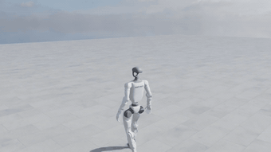
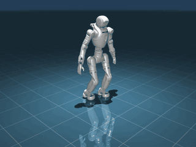
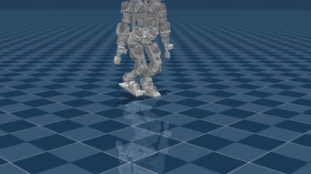

# Yanshi RL Lab

[](https://isaac-sim.github.io/IsaacLab/)
[](https://docs.python.org/3/whatsnew/3.11.html)
[](LICENSE)
[](CHANGELOG.md)

<p>
<a href="README.md"></a>
<a href="docs/i18n/zh/README.md"></a>
<a href="docs/i18n/ja/README.md"></a>
<a href="docs/i18n/fr/README.md"></a>
</p>
A vendor-neutral reinforcement learning framework for legged robots: train in Isaac Lab,
validate in MuJoCo, and score every robot on the same exam paper.

<p align="center">
  
  
  
</p>

---

## Overview

Most locomotion repositories are built around one robot: the body's quirks are spread through
the task recipes, and porting to a second robot means a rewrite. This one inverts that. A robot
is a *profile* — joints, gains, and a semantic mapping of its body parts — and task recipes
reach the body only through those semantic slots. Adding a vendor means adding a directory, not
editing shared code.

A policy is not finished when the training curve looks good. Here it must survive a second
physics engine: every policy is exported to ONNX, replayed in MuJoCo through one deterministic
closed loop, and judged against thresholds that were frozen before the run existed. The
thresholds live in YAML, never in Python, so changing one is a visible, auditable diff.

The three launch robots differ enough to keep the abstraction honest: a 1.32 m humanoid, a
1.3 m humanoid from a different vendor, and a 0.6 m open-source printable one with no waist
joint and legs 40% as long. Every registered configuration, what it is pinned to and how
far it has been taken here is listed in [ROBOTS_INTRO.md](ROBOTS_INTRO.md).

The name is the thesis. Yanshi (偃师) was the artificer who presented King Mu of Zhou with an
automaton that could walk — he was not the robot, he was the one who taught it to walk. This
repository is the workshop, not any particular body.

## Yanshi Rank

Every robot takes the same four-gate exam on flat ground, under fixed commands and
deterministic inference. Lines are pre-registered per robot from its own trained command
envelope, and a fall fails the gate outright.

| Robot | Turn in place | Turn while walking | Walk 8 s | Slow walk 8 s | Gates |
|---|---|---|---|---|---|
| Unitree G1 (29-DoF) | 280.4° | r = 0.60 m | 4.30 m | 2.20 m | 4/4 |
| AgiBot Lingxi X2 | 85.5° | r = 2.10 m | 4.58 m | 1.79 m | 4/4 |
| Berkeley Humanoid Lite | 7.1° | r = 1.61 m | 2.75 m | 0.02 m | 2/4 |

Berkeley Humanoid Lite walks, but only inside a narrow command comfort zone: below 0.4 m/s it
ignores the command entirely, and both failed gates sit outside that zone. The cause is located
(a training command envelope far wider than the exam points, so slow commands are rare in the
sampling distribution) and recorded rather than papered over. Single seed; multi-seed baselines
are a v0.2 standard.

## Key features

- **Robot as a profile**: everything true of exactly one body lives in `robots/<vendor>/<model>/profile.py`, and a complete profile trains with an *empty* per-robot task overlay.
- **Sim2sim as an exit criterion**: one policy contract (`schema_version: 2`) carries a run from training to MuJoCo replay; a policy that only works in the trainer is not a result.
- **Declarative gates**: thresholds live in `benchmark/gates/*.yaml`, so a moved goalpost is a diff on a config file rather than a line buried in judgement code.
- **Assets by reference**: third-party robot models are fetched from pinned upstream commits, never committed — licenses differ per vendor.
- **CPU-only test suite**: profiles, contract, gate parsing and the scaffolder are all testable without a simulator or a GPU.

## Installation

Requires [Isaac Lab 2.3.2](https://isaac-sim.github.io/IsaacLab/main/source/setup/installation/index.html)
and its Isaac Sim dependency. Install this extension into the same environment:

```bash
git clone https://github.com/jeffliulab/yanshi-rl-lab.git
cd yanshi-rl-lab
pip install -e source/yanshi_rl_lab

yanshi doctor          # environment self-check; pure CPU, never crashes
yanshi assets fetch    # pull pinned robot models (not stored in this repo)
```

## Quick start

```bash
# 1. tests — CPU only, no simulator needed
pytest -q

# 2. train (Isaac Lab's launcher, not bare python)
./isaaclab.sh -p scripts/rsl_rl/train.py \
    --task Yanshi-Velocity-Flat-Unitree-G1-Dof29-v0 --headless \
    --num_envs 4096 --max_iterations 10000 --seed 42

# 3. replay a checkpoint and record video
./isaaclab.sh -p scripts/rsl_rl/play.py \
    --task Yanshi-Velocity-Flat-Unitree-G1-Dof29-v0 \
    --checkpoint logs/rsl_rl/<run>/model_9999.pt --video --headless

# 4. sim2sim gates in MuJoCo — CPU only, this is the acceptance step
python scripts/sim2sim/run_gates.py \
    --gates benchmark/gates/velocity-flat-turn.yaml \
    --contract logs/rsl_rl/<run>/params/contract.json \
    --policy logs/rsl_rl/<run>/exported/policy.onnx
```

Exit code is `0` when every gate passes, `1` when one does not, `2` when a veto line trips.

## Adding a robot

```bash
python scripts/tools/new_robot.py --vendor <vendor> --model <model>
```

The scaffolder writes a profile skeleton and its test. Fill in joints, gains and the semantic
body-part mapping, pin the asset source in `assets/registry.py`, then train with an empty task
overlay — reach for an override only when a measurement proves one is needed, and put the
measurement in the commit message.

## Status

v0.1 is in progress. Two of the three launch robots pass their flat-ground gates; the third
walks but misses two gates for the reason described above. Rough terrain, domain randomization
and the published rank site are v0.2 work. Results here are single-seed and should be read as
such.

## Acknowledgements

Built on [Isaac Lab](https://github.com/isaac-sim/IsaacLab) and
[RSL-RL](https://github.com/leggedrobotics/rsl_rl). Robot models come from their vendors:
[Unitree](https://github.com/unitreerobotics), [AgiBot](https://github.com/AgibotTech), and
[Berkeley Humanoid Lite](https://github.com/HybridRobotics/Berkeley-Humanoid-Lite). Agent-facing
conventions follow [agent-rules](https://github.com/jeffliulab/agent-rules).

MIT © 2026 Jeff Liu. Some launcher scripts derive from the Isaac Lab template
(BSD-3-Clause); robot assets stay under their vendors' licenses — see [NOTICE](NOTICE).
