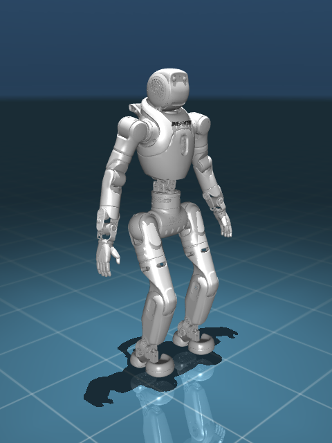
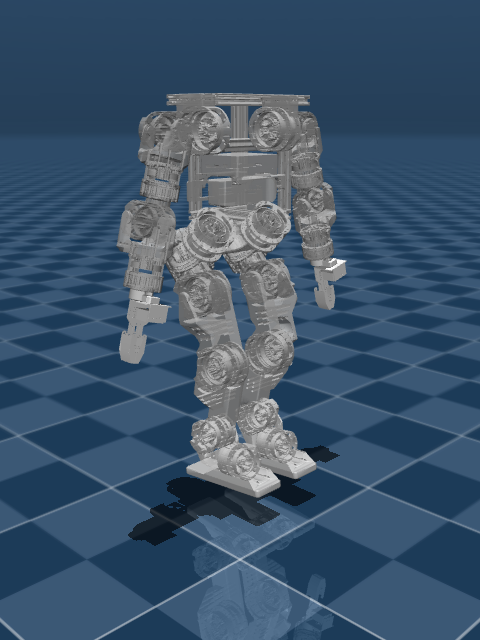
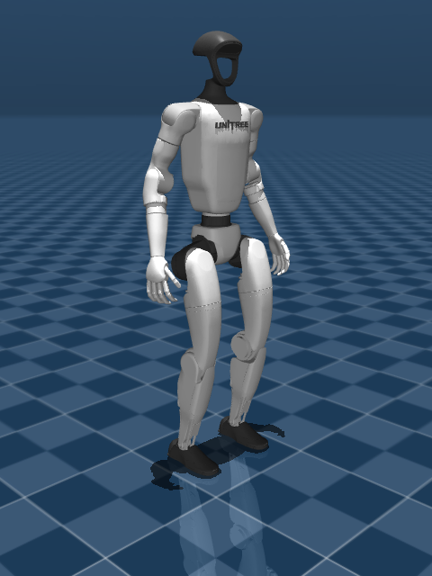
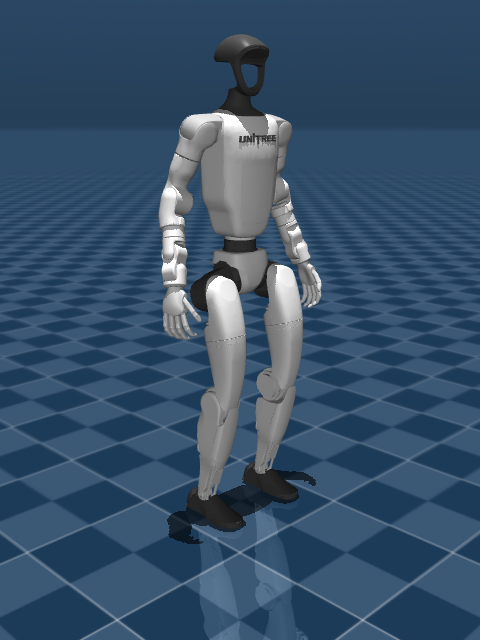

<!-- Generated by scripts/tools/render_robots_intro.py -- do not edit by hand. -->

# Robots

Every robot configuration this framework carries, what it is pinned to, and
how far it has actually been taken here. Identity is
`<vendor>/<model>/<variant>`; the variant segment is mandatory, so a row
always says *which* configuration of a model it means.

| Status | Meaning |
|---|---|
| **ranked** | a leaderboard entry exists — see [Yanshi Rank](benchmark/site/rank.md) |
| **exam frozen** | acceptance gates are written and frozen; nothing ranked yet |
| **registered** | profile and task exist; no exam written yet |

None of these means "it works". A ranked robot can be ranked with failing
gates, and one below is — a board that lists only passes reports by omission.

Robot models are **not** redistributed here. Each is fetched from a pinned
upstream commit and stays under its vendor's licence; the thumbnails are
renders of those models, made by
`scripts/tools/render_robot_thumbs.py`.

## At a glance

| | Robot | DoF | Status | Upstream licence |
|---|---|---|---|---|
|  | `agibot/x2/v1_4_0` | 31 | ranked | MulanPSL-2.0 |
|  | `berkeley/humanoid_lite/humanoid` | 22 | ranked | CC-BY-SA-4.0 |
|  | `unitree/g1/dof23` | 23 | registered | BSD-3-Clause |
|  | `unitree/g1/dof29` | 29 | ranked | BSD-3-Clause |

## `agibot/x2/v1_4_0`

- **Configuration**: v1_4_0 — 31 actuated joints
- **Assets**: `agibot/x2` (shared by every variant of this model), licence MulanPSL-2.0
  - [agibot_x2_urdf](https://github.com/AgibotTech/agibot_x2_urdf/tree/77f43eb0904dae4c48ccd9154fee824f8ffd4d38) @ `77f43eb0904d`
- **Status**: ranked
- **Exams**: [`velocity-flat-x2`](benchmark/gates/velocity-flat-x2.yaml) (velocity-flat)
- **Ranked** on `velocity-flat-x2` (1 seed): turn_in_place_deg 85.5035, turn_walk_radius_m 2.1021, walk_8s_m 4.5849, slow_walk_8s_m 1.7922

## `berkeley/humanoid_lite/humanoid`

- **Configuration**: humanoid — 22 actuated joints
- **Assets**: `berkeley/humanoid_lite` (shared by every variant of this model), licence CC-BY-SA-4.0
  - [Berkeley-Humanoid-Lite-Assets](https://github.com/HybridRobotics/Berkeley-Humanoid-Lite-Assets/tree/fc90fedd008b1e56a22e3c5221548d6b24f49707) @ `fc90fedd008b`
- **Status**: ranked
- **Exams**: [`velocity-flat-bhl`](benchmark/gates/velocity-flat-bhl.yaml) (velocity-flat)
- **Ranked** on `velocity-flat-bhl` (1 seed): turn_in_place_deg 7.1174, turn_walk_radius_m 1.6082, walk_8s_m 2.7507, slow_walk_8s_m 0.02

## `unitree/g1/dof23`

- **Configuration**: dof23 — 23 actuated joints
- **Assets**: `unitree/g1` (shared by every variant of this model), licence BSD-3-Clause
  - [unitree_ros](https://github.com/unitreerobotics/unitree_ros/tree/f3772ce54c56ef2d34c6aee8100bc768896c7d19) @ `f3772ce54c56`
  - [unitree_mujoco](https://github.com/unitreerobotics/unitree_mujoco/tree/ae6a8403e272733e9996ef59990880330496177f) @ `ae6a8403e272`
- **Status**: registered
- **Exams**: none written yet

## `unitree/g1/dof29`

- **Configuration**: dof29 — 29 actuated joints
- **Assets**: `unitree/g1` (shared by every variant of this model), licence BSD-3-Clause
  - [unitree_ros](https://github.com/unitreerobotics/unitree_ros/tree/f3772ce54c56ef2d34c6aee8100bc768896c7d19) @ `f3772ce54c56`
  - [unitree_mujoco](https://github.com/unitreerobotics/unitree_mujoco/tree/ae6a8403e272733e9996ef59990880330496177f) @ `ae6a8403e272`
- **Status**: ranked
- **Exams**: [`velocity-flat-straight-g1`](benchmark/gates/velocity-flat-straight-g1.yaml) (velocity-flat), [`velocity-flat-turn`](benchmark/gates/velocity-flat-turn.yaml) (velocity-flat), [`velocity-rough-straight-g1`](benchmark/gates/velocity-rough-straight-g1.yaml) (velocity-rough)
- **Ranked** on `velocity-flat-turn` (1 seed): turn_in_place_deg 280.4358, turn_walk_radius_m 0.5968, walk_8s_m 4.3013, slow_walk_8s_m 2.1975
- **Ranked** on `velocity-rough-straight-g1` (1 seed): rough_low_20s_m 7.0862, rough_mid_20s_m 0.1612

## Adding one

```bash
python scripts/tools/new_robot.py <vendor> <model> <variant>
```

The variant is upstream's own name for the configuration — `dof29` because
Unitree ships `g1_29dof_rev_1_0.urdf`, `v1_4_0` because the X2 model
directory is `X2_URDF-v1.4.0` — and it must start with a letter, because
every segment is also a Python package name. See `AGENTS.md` for the rules
and `yanshi robots` for what is registered right now.
